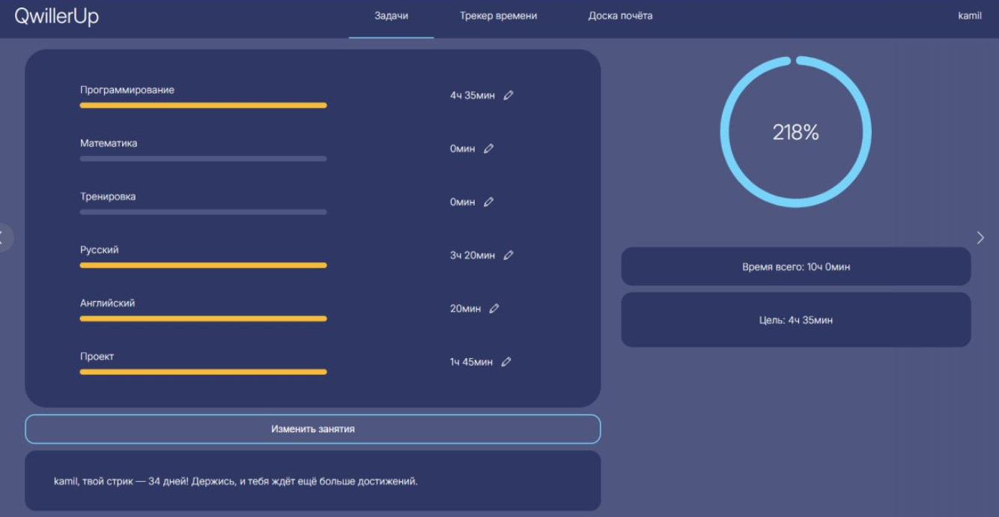
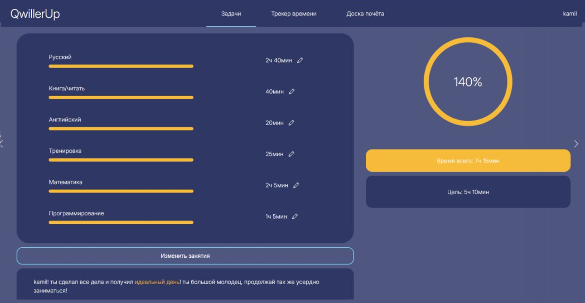
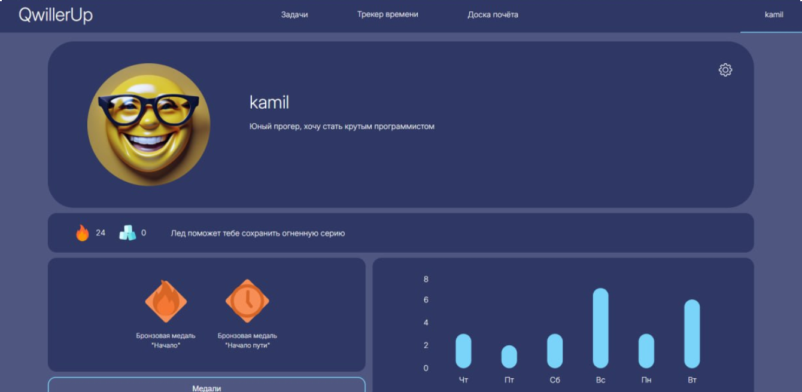
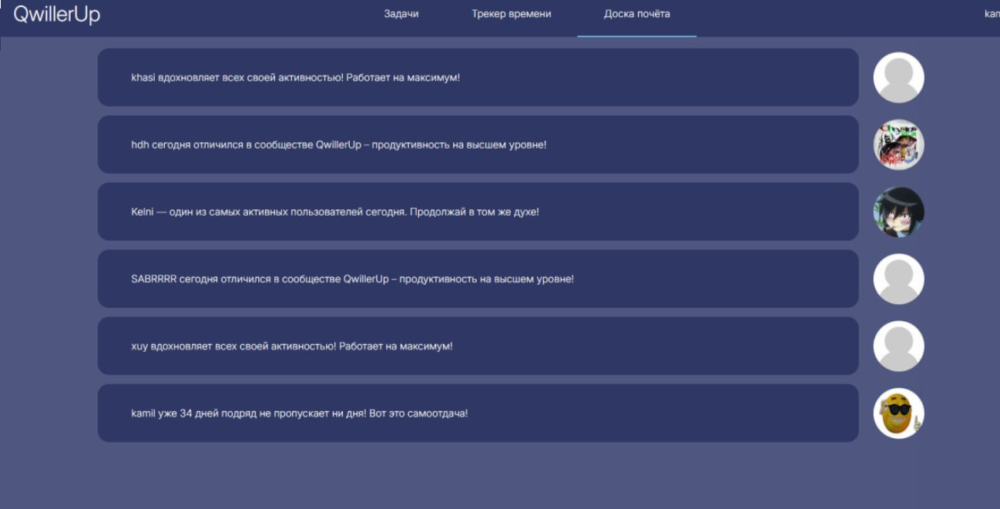

# 🚀 QwillerUp

> Геймифицированный трекер привычек и задач. Превращает рутину в игру, мотивируя заниматься каждый день больше запланированного времени.

[](https://qwiller-up.vercel.app/)
[](https://www.figma.com/design/n9S1WNhRuXuSFVVLJlY9nA/%D0%93%D0%BB%D0%B0%D0%B2%D0%BD%D0%B0%D1%8F?node-id=0-1&t=67RCncPQJsi0NCsg-1)


---

## 🎯 Идея проекта

**Проблема:** Людям тяжело поддерживать ежедневную мотивацию для учебы или работы. Сухие списки дел (To-Do) не вызывают эмоций и быстро забрасываются.

**Решение (Метод QwillerUp):** Проект объединяет тайм-менеджмент и геймификацию. Пользователь задает не просто задачи, а **цели по времени**. Приложение визуально поощряет перевыполнение плана, награждает медалями, ведет учет непрерывных дней (стриков) и выводит самых усердных на общую Доску почёта.

---

## ✨ Ключевой функционал

- ⏱ **Гибкий тайм-трекинг:** Установка целей по времени для каждой задачи. Прогресс-бар показывает процент выполнения (можно сделать 200% и больше!).
- 🏆 **Механика «Идеального дня»:** Если пользователь выполняет дневную норму, интерфейс меняет цветовую схему на «золотую», давая визуальное подкрепление.
- 🔥 **Система мотивации:** 
  - **Стрики:** Подсчет дней непрерывной активности.
  - **Ачивки:** Выдача медалей за достижения (первый день, неделя активности и т.д.).
- 👥 **Доска почёта:** Глобальный лидерборд активных пользователей с автоматической генерацией мотивирующих статусов.
- 📊 **Аналитика профиля:** График активности по дням недели (интеграция `recharts`), настройка аватарок и личных данных.
- 📱 **Адаптивный дизайн:** Корректное отображение на любых устройствах.

---

## 🖼 Интерфейс и Дизайн

Весь проект спроектирован с нуля. Макеты, состояния модальных окон и UI-кит доступны в [Figma](https://www.figma.com/design/n9S1WNhRuXuSFVVLJlY9nA/%D0%93%D0%BB%D0%B0%D0%B2%D0%BD%D0%B0%D1%8F?node-id=0-1&t=67RCncPQJsi0NCsg-1).

| Обычный прогресс | Состояние «Идеальный день» |
|:---:|:---:|
|  |  |
| **Профиль и Статистика** | **Глобальная доска почёта** |
|  |  |

*(Внимание: для корректного отображения картинок, создай папку `docs` внутри `frontend/src/assets/` и положи туда скриншоты под этими именами, либо перетащи картинки прямо в GitHub)*

---

## 🛠 Технологический стек (Full-Stack Monorepo)

### Frontend (`/frontend`)
- **Core:** React 18, Vite, React Router v7
- **Styling:** SCSS Modules (`.module.scss`) для изолированной стилизации.
- **Data Visualization:** Recharts (графики активности), React Content Loader (скелетоны загрузки).
- **Utils:** Browser Image Compression (оптимизация аватарок перед отправкой).

### Backend (`/backend`)
- **Core:** Python, Django 5.1
- **API & Auth:** Django REST Framework (DRF), SimpleJWT (авторизация по токенам).
- **Database:** PostgreSQL (`psycopg2`) / SQLite.
- **Server/Deploy:** Gunicorn, Whitenoise (раздача статики).
- **Images:** Pillow (обработка изображений).

---

## 🚀 Локальный запуск (Development)

Проект использует архитектуру монорепозитория. Для запуска потребуется два терминала.

### 1. Запуск Backend (Терминал 1)
\```bash
cd backend
python -m venv venv
# Активация: venv\Scripts\activate (Win) / source venv/bin/activate (Mac/Linux)
pip install -r requirements.txt
python manage.py migrate
python manage.py runserver
\```

### 2. Запуск Frontend (Терминал 2)
\```bash
cd frontend
npm install
npm run dev
\```

---

## 📌 Статус проекта
*Этот проект был разработан мной в 10 классе как первый серьезный Full-Stack опыт.
